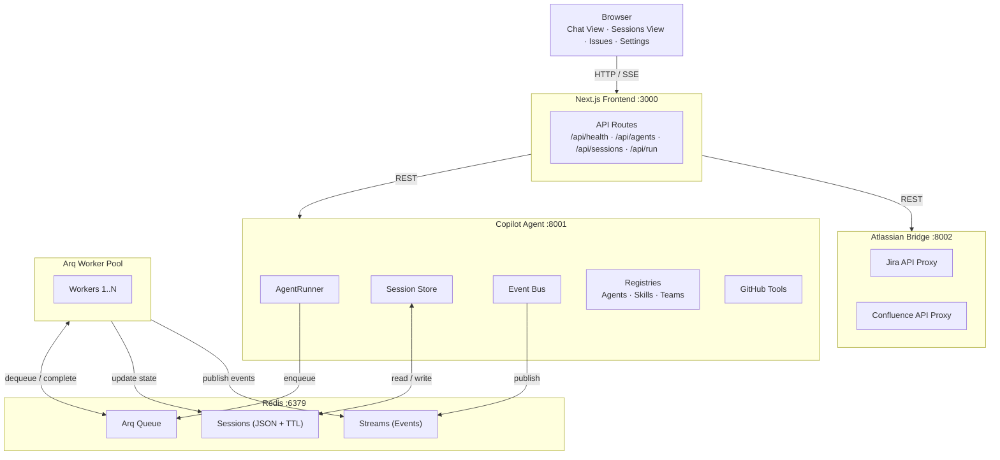
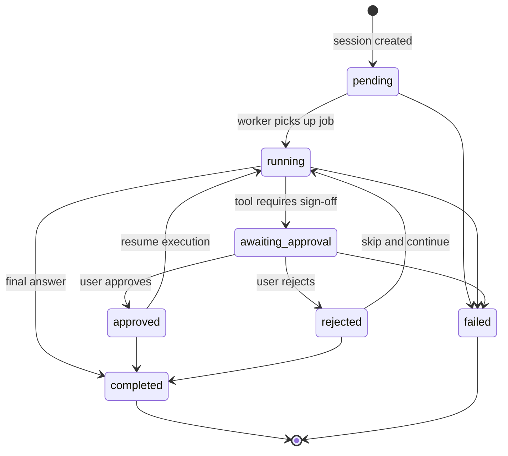
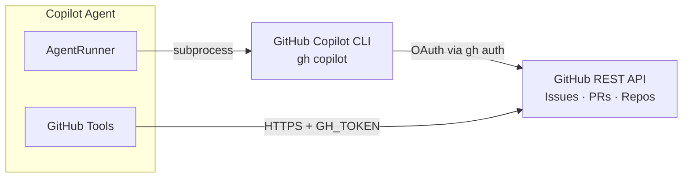
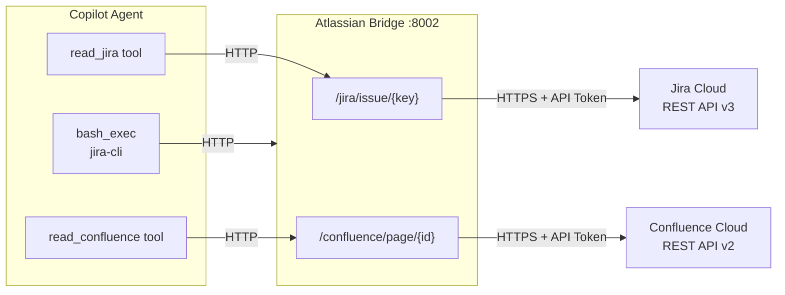
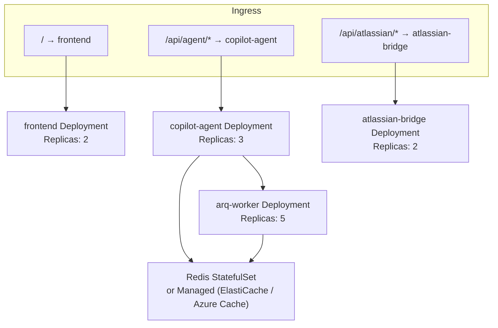
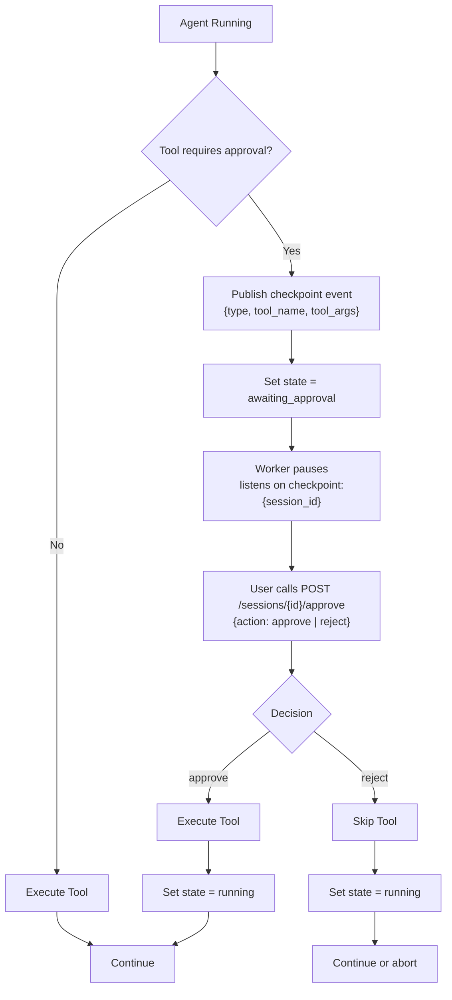

# SDLC AI Agent Platform — System Architecture

This document provides a comprehensive architectural view of the SDLC AI Agent Platform, covering the system design, component interactions, data flows, and key architectural decisions.

---

## Table of Contents

1. [System Context](#system-context)
2. [Architectural Principles](#architectural-principles)
3. [Component Architecture](#component-architecture)
4. [Data Architecture](#data-architecture)
5. [Integration Architecture](#integration-architecture)
6. [Security Architecture](#security-architecture)
7. [Deployment Architecture](#deployment-architecture)
8. [Agent Orchestration Model](#agent-orchestration-model)
9. [Session State Machine](#session-state-machine)
10. [Event-Driven Architecture](#event-driven-architecture)
11. [Scalability & Performance](#scalability--performance)
12. [Architectural Decision Records](#architectural-decision-records)

---

## System Context

### Purpose
The SDLC AI Agent Platform automates software development lifecycle workflows by orchestrating specialized AI agents that interact with enterprise systems (Jira, Confluence, GitHub) and execute development tasks (testing, analysis, code generation, documentation).

### Key Stakeholders
- **Business Analysts**: Use BA agents to analyze requirements from Jira tickets
- **QA Engineers**: Use test agents to generate automated tests from specifications
- **Developers**: Use coder agents for code generation and review
- **DevOps Engineers**: Deploy and maintain the platform infrastructure
- **Product Teams**: Configure team-specific workflows and approval policies

### External Systems
- **GitHub**: Issue tracking, code repositories, GitHub Copilot CLI
- **Jira**: Issue tracking, project management
- **Confluence**: Documentation and knowledge base
- **LLM Providers**: GitHub Models (GPT-4o, Claude 3.5 Sonnet, etc.)

---

## Architectural Principles

### 1. **Separation of Concerns**
- Frontend handles UI/UX only, no business logic
- Backend services are single-purpose (agent orchestration, Atlassian proxy)
- Clear API boundaries between components

### 2. **Event-Driven Design**
- Redis Streams for session events
- Asynchronous job processing with Arq
- Real-time updates via Server-Sent Events (SSE)

### 3. **Stateless Execution**
- `/run` and `/stream` endpoints are stateless (no Redis dependency)
- Session-based workflows store state in Redis with TTL
- Workers are horizontally scalable with no shared state

### 4. **Security by Design**
- Credentials never exposed to frontend
- Atlassian Bridge acts as secure proxy
- GitHub authentication via CLI OAuth (no tokens in code)
- Approval gates for destructive operations

### 5. **Extensibility**
- Agent registry loaded from flat files (no code changes needed)
- Skill registry for reusable agent capabilities
- Team manifests for org-specific configuration
- Tool execution framework supports custom tools

### 6. **Fail-Safe Defaults**
- Sessions expire after 24h (configurable)
- Turn budget limits prevent runaway agents
- Human approval required for sensitive operations (when configured)
- Graceful degradation when external services are unavailable

---

## Component Architecture

### High-Level Component Diagram



### Component Descriptions

#### 1. Next.js Frontend
- **Technology**: Next.js 16 (App Router), React 19, Tailwind CSS 4
- **Responsibilities**:
  - Render UI for chat, sessions, issue creation
  - Proxy API calls to backend services
  - Handle SSE connections for real-time updates
  - Client-side state management with SWR
- **Key Files**:
  - `app/page.tsx` — Main chat interface
  - `app/sessions/page.tsx` — Session list view
  - `app/sessions/[id]/page.tsx` — Session detail with live events
  - `app/api/*` — Next.js API routes (thin proxies)

#### 2. Copilot Agent API Server
- **Technology**: FastAPI, GitHub Copilot SDK, asyncio
- **Responsibilities**:
  - Agent orchestration and execution
  - Tool registration and invocation
  - Session lifecycle management
  - Event publishing to Redis Streams
  - Job enqueueing for Arq workers
- **Key Modules**:
  - `agent_copilot.py` — Core agent runner with turn-based execution
  - `api_server.py` — FastAPI application and route handlers
  - `registry.py` — Agent, Skill, and Team registries
  - `session_store.py` — Redis session persistence
  - `event_bus.py` — Redis Streams event publisher
  - `checkpoint_gate.py` — Approval gate logic
  - `worker.py` — Arq worker function definitions

#### 3. Atlassian Bridge
- **Technology**: FastAPI, httpx
- **Responsibilities**:
  - Proxy Jira REST API v3 calls
  - Proxy Confluence REST API v2 calls
  - Centralized credential management
  - Request/response transformation
- **Key Files**:
  - `app/main.py` — FastAPI application
  - `app/jira.py` — Jira endpoint handlers
  - `app/confluence.py` — Confluence endpoint handlers
  - `app/client.py` — Shared httpx client with auth

#### 4. Redis
- **Technology**: Redis 7 (Alpine)
- **Responsibilities**:
  - Session state storage (JSON with TTL)
  - Event streaming (Redis Streams)
  - Arq job queue
  - Pub/Sub for approval decisions
- **Data Structures**:
  - **Keys**: `session:{id}` (JSON, 24h TTL)
  - **Streams**: `session:{id}:events` (event log)
  - **Lists**: `arq:queue` (job queue)
  - **Channels**: `checkpoint:{session_id}` (approval decisions)

#### 5. Arq Worker Pool
- **Technology**: Arq (async job queue), asyncio
- **Responsibilities**:
  - Execute long-running agent workflows asynchronously
  - Process approval checkpoints
  - Publish events to Redis Streams
  - Update session state
- **Scaling**: Horizontally scalable (run N workers)
- **Job Types**:
  - `run_agent_session` — Full agent execution with approval gates

---

## Data Architecture

### Session Entity Model

```python
class Session(BaseModel):
    # Identity
    id: str                                # UUID
    
    # Configuration
    agent_file: str                        # e.g., "ba.agent.md"
    model: str                             # e.g., "gpt-4o"
    max_turns: int                         # Turn budget (default 20)
    instruction: str                       # User prompt
    extra_context: str                     # Additional context
    
    # Execution mode
    execution_mode: "autonomous" | "human_touch"
    approval_policy: list[str]             # e.g., ["create_github_issue", "jira:write"]
    
    # State
    state: SessionState                    # FSM state (see below)
    created_at: datetime
    updated_at: datetime
    
    # Results
    result: str | None                     # Final output
    error: str | None                      # Error message if failed
    
    # Integrations
    jira_url: str | None                   # Jira issue URL
    confluence_pages: list[str]            # Confluence page IDs
    github_issue_url: str | None           # Created GitHub issue URL
    
    # Checkpoints
    pending_checkpoint: dict | None        # Current approval gate data
    
    # Team context
    team_id: str | None                    # Team manifest ID
    custom_agent: str | None               # GitHub cloud agent URL
```

### Session State Machine



**State Descriptions**:
- **`pending`**: Session created, waiting to be enqueued
- **`running`**: Worker is actively executing the agent
- **`awaiting_approval`**: Agent paused at checkpoint, waiting for human decision
- **`approved`**: Human approved the checkpoint, resuming execution
- **`rejected`**: Human rejected the checkpoint, may terminate or retry
- **`completed`**: Agent finished successfully
- **`failed`**: Agent encountered unrecoverable error

### Event Stream Schema

Each event in `session:{id}:events` is a Redis Stream entry with:

```json
{
  "timestamp": "2026-05-23T10:30:00Z",
  "type": "state_change | tool_call | checkpoint | result | error",
  "data": {
    "state": "running",
    "tool_name": "bash_exec",
    "tool_args": { "command": "ls -la" },
    "tool_result": "...",
    "checkpoint_id": "chk_abc123",
    "action": "create_github_issue",
    "result": "Final output",
    "error": "Error message"
  }
}
```

**Event Types**:
- **`state_change`**: Session FSM transition
- **`tool_call`**: Tool invocation started
- **`tool_result`**: Tool invocation completed
- **`checkpoint`**: Approval gate triggered
- **`checkpoint_resolved`**: Human approved/rejected
- **`agent_message`**: Agent reasoning or response
- **`result`**: Final result available
- **`error`**: Error occurred

---

## Integration Architecture

### GitHub Integration



**Authentication Flow**:
1. `gh auth login` stores OAuth token in CLI keyring
2. GitHub Copilot SDK delegates to `gh copilot` subprocess
3. GitHub REST API calls use `GH_TOKEN` environment variable

### Atlassian Integration



**Authentication Flow**:
1. Atlassian Bridge holds `JIRA_API_TOKEN` and `CONFLUENCE_API_TOKEN`
2. Agent sends requests to Bridge (no credentials)
3. Bridge adds auth headers and forwards to Atlassian Cloud
4. Response returned to agent

**Benefits**:
- Centralized credential management
- Frontend never sees Atlassian credentials
- Single point for audit logging
- Rate limiting and retry logic in one place

---

## Security Architecture

### Threat Model

| Threat | Mitigation |
|--------|------------|
| Credential exposure in frontend | Credentials stored server-side only, proxied via Atlassian Bridge |
| Unauthorized agent execution | Team manifests whitelist allowed agents |
| Destructive operations | Approval gates require human sign-off for sensitive tools |
| Redis data leakage | Redis bound to localhost in dev, VPC-only in prod |
| Session hijacking | Session IDs are UUIDs, 24h TTL, no session cookies |
| Code injection via `bash_exec` | 120s timeout, no shell expansion, stdout/stderr sanitized |
| XSS in chat responses | React auto-escapes, markdown rendered with `remark-gfm` (safe) |

### Authentication & Authorization

#### GitHub
- **Dev**: `gh auth login` (OAuth, stored in OS keyring)
- **Prod**: GitHub App with fine-grained permissions

#### Atlassian
- **All envs**: API token (email + token), stored in `atlassian-bridge` env vars

#### Redis
- **Dev**: No auth (localhost only)
- **Prod**: Redis ACL or VPC-only access

### Data at Rest
- **Redis**: Sessions stored as JSON, TTL evicts after 24h
- **Logs**: Avoid logging credentials or PII
- **Attachments**: Jira attachments fetched on-demand, not persisted

### Data in Transit
- **Dev**: HTTP between containers (Docker network)
- **Prod**: HTTPS with TLS 1.3, valid certificates

---

## Deployment Architecture

### Docker Compose (Development)

```yaml
services:
  frontend:        # Next.js on :3000
  copilot-agent:   # FastAPI on :8001
  atlassian-bridge:# FastAPI on :8002
  arq-worker:      # Background worker (no exposed port)
  redis:           # Redis on :6379
```

**Network**:
- All services on default bridge network
- Frontend talks to copilot-agent via `http://copilot-agent:8001`
- Workers talk to Redis via `redis://redis:6379/0`

### Kubernetes (Production)



**Scaling Strategy**:
- **Frontend**: Scale based on HTTP request rate (HPA)
- **Copilot Agent**: Scale based on CPU/memory (HPA)
- **Arq Workers**: Scale based on queue depth (`arq:queue` length)
- **Redis**: Vertical scaling or managed service (AWS ElastiCache, Azure Cache)

---

## Agent Orchestration Model

### Turn-Based Execution

Agents operate in a turn-based loop:

```python
for turn in range(max_turns):
    # 1. Agent thinks and decides on action
    response = await copilot_client.complete(messages, tools)
    
    # 2. If tool call, execute it
    if response.tool_calls:
        for tool_call in response.tool_calls:
            # Check approval gate
            if requires_approval(tool_call):
                await pause_for_approval(tool_call)
            
            # Execute tool
            result = await execute_tool(tool_call)
            messages.append({"role": "tool", "content": result})
    
    # 3. If final answer, return
    elif response.content:
        return response.content
    
    # 4. Otherwise, continue loop
```

### Tool Execution Framework

```python
class Tool:
    name: str
    description: str
    parameters: dict  # JSON Schema
    
    async def execute(self, **kwargs) -> str:
        # Tool implementation
        pass

# Built-in tools
bash_exec: Tool           # Execute shell commands
invoke_agent: Tool        # Delegate to sub-agent
read_jira: Tool           # Fetch Jira issue
create_github_issue: Tool # Create GitHub issue
read_confluence: Tool     # Fetch Confluence page
```

### Sub-Agent Delegation

Agents can delegate sub-tasks to specialized agents:

```python
# BA agent delegates test generation to test-designer agent
result = await invoke_agent(
    agent_file="test-designer.agent.md",
    instruction="Generate test cases for SCRUM-123",
    max_turns=15
)
```

**Depth Limiting**:
- Max recursion depth: 3 (configurable)
- Sub-agents inherit reduced turn budget
- Prevents infinite delegation loops

---

## Session State Machine

### State Transitions

```python
_TRANSITIONS: dict[SessionState, set[SessionState]] = {
    "pending": {"running", "failed"},
    "running": {"awaiting_approval", "completed", "failed"},
    "awaiting_approval": {"approved", "rejected", "failed"},
    "approved": {"running", "completed"},
    "rejected": {"running", "completed"},
    "completed": set(),  # terminal
    "failed": set(),     # terminal
}
```

### Checkpoint Flow

### Checkpoint Flow



---

## Event-Driven Architecture

### Redis Streams

Each session has its own Redis Stream: `session:{id}:events`

**Producer**: Worker publishes events during agent execution
**Consumer**: Frontend subscribes via `/sessions/{id}/events` SSE endpoint

```python
# Worker publishes event
await event_bus.publish(
    session_id,
    event_type="tool_call",
    data={"tool_name": "bash_exec", "command": "ls"}
)

# API server consumes and streams to SSE client
async for event in event_bus.subscribe(session_id, from_id="0"):
    yield f"data: {json.dumps(event)}\n\n"
```

### Job Queue (Arq)

```python
# API server enqueues job
job = await arq_pool.enqueue_job(
    "run_agent_session",
    session_id,
    _queue_name="arq:queue"
)

# Worker processes job
@arq_function
async def run_agent_session(ctx, session_id: str) -> None:
    session = await session_store.get(session_id)
    runner = AgentRunner(session.agent_file, session.model)
    result = await runner.run(session.instruction)
    await session_store.update(session_id, {"result": result})
```

---

## Scalability & Performance

### Horizontal Scaling

| Component | Scaling Strategy | Bottleneck |
|-----------|------------------|------------|
| Frontend | Stateless, scale with load balancer | None |
| Copilot Agent API | Stateless `/run` and `/stream`, scale freely | LLM API rate limits |
| Atlassian Bridge | Stateless, scale freely | Jira/Confluence API rate limits |
| Arq Workers | Scale to match queue depth | Redis throughput |
| Redis | Vertical scaling or sharding | Memory, network I/O |

### Performance Characteristics

- **Stateless execution (`/run`, `/stream`)**: 
  - Latency: 2-10s (depends on LLM response time)
  - Throughput: 100+ req/s (limited by LLM API)

- **Session-based execution**:
  - Job enqueue latency: <50ms
  - Worker pickup latency: <1s
  - Total execution time: 10s - 5min (depends on workflow complexity)

### Caching Strategy

- **Agent definitions**: Loaded once at startup, hot-reload on file change
- **Skills**: Loaded once at startup
- **Teams**: Loaded once at startup
- **Sessions**: Redis with 24h TTL (automatic eviction)
- **LLM responses**: No caching (each agent run is unique)

---

## Architectural Decision Records

### ADR-001: GitHub Copilot SDK vs. Azure AI Inference

**Decision**: Use GitHub Copilot SDK with CLI OAuth as primary agent backend

**Rationale**:
- No need to manage GitHub tokens in code
- Access to all Copilot-supported models (GPT-4o, Claude, etc.)
- Better developer experience (same auth as VS Code)
- Fallback to `azure-ai-inference` available if needed

**Trade-offs**:
- Requires GitHub CLI installed on worker nodes
- OAuth flow more complex in containerized environments
- `azure-ai-inference` kept as fallback for token-based auth

---

### ADR-002: Redis vs. PostgreSQL for Session State

**Decision**: Use Redis with JSON + TTL for session state

**Rationale**:
- Sessions are ephemeral (24h TTL)
- High read/write throughput needed for event streams
- Redis Streams provide built-in event log
- Simple data model (no complex queries needed)
- Easy to scale horizontally (Redis Cluster)

**Trade-offs**:
- No ACID guarantees (acceptable for sessions)
- Limited query capabilities (no SQL)
- Data lost on Redis failure (acceptable, sessions are not critical)

---

### ADR-003: Monorepo vs. Polyrepo

**Decision**: Hybrid — monorepo for frontend + copilot-agent, separate repo for atlassian-bridge

**Current State**: All in monorepo

**Rationale**:
- Simplifies local development (single `docker compose up`)
- Shared types and utilities between frontend and backend
- Atomic commits across full stack
- Single deployment pipeline

**Trade-offs**:
- Larger repo size
- Frontend and backend teams may have merge conflicts
- Could split atlassian-bridge into separate repo later

---

### ADR-004: Approval Gate Design

**Decision**: Use Redis Pub/Sub for approval decisions, not polling

**Rationale**:
- Real-time response when user approves/rejects
- Worker doesn't need to poll database
- Clean separation between API and worker
- Scales well with multiple workers

**Trade-offs**:
- Requires reliable Redis Pub/Sub (no message persistence)
- If worker dies during approval wait, checkpoint is lost (acceptable, session TTL handles cleanup)

---

### ADR-005: Agent File Format

**Decision**: YAML frontmatter + Markdown body

**Rationale**:
- Human-readable and editable (no code changes needed)
- Frontmatter for structured metadata (id, triggers, skills, tools)
- Markdown body for natural language prompt
- Easily version-controlled
- Supports hot-reload without server restart

**Trade-offs**:
- Parsing overhead (negligible, files cached in memory)
- Limited validation (no schema enforcement at write time)
- Could add JSON Schema validation later

---

### ADR-006: Stateless vs. Stateful Endpoints

**Decision**: Provide both `/run` (stateless) and `/sessions` (stateful)

**Rationale**:
- `/run` and `/stream` for quick interactive queries (no Redis overhead)
- `/sessions` for long-running workflows with approval gates
- Users choose based on use case
- Stateless endpoints can scale independently

**Trade-offs**:
- Two execution paths to maintain
- Slight code duplication (acceptable, isolated in api_server.py)

---

## Future Architecture Considerations

### Multi-Tenancy
- Namespace Redis keys by tenant: `{tenant}:session:{id}`
- Team manifests scoped to tenants
- Rate limiting per tenant

### Agent Marketplace
- Publish/subscribe model for agent sharing
- Agent versioning and dependency management
- Community-contributed agents

### Observability
- OpenTelemetry instrumentation
- Distributed tracing across agent → tool → external API
- Prometheus metrics for queue depth, turn count, tool usage

### Event Sourcing
- Current: Events stored in Redis Streams (ephemeral)
- Future: Archive events to S3/PostgreSQL for audit trail
- Event replay for debugging and testing

---

## Conclusion

The SDLC AI Agent Platform is designed as a modular, event-driven system that balances simplicity (stateless execution for simple queries) with scalability (stateful sessions for complex workflows). The architecture prioritizes security, extensibility, and developer experience while maintaining clear separation of concerns across components.

Key architectural strengths:
- **Composability**: Agents can delegate to sub-agents
- **Extensibility**: New agents, skills, and tools added via config files
- **Scalability**: Stateless services + horizontally scalable workers
- **Security**: Credentials isolated in proxy services, approval gates for sensitive ops
- **Observability**: Event streams provide full audit trail

For deployment guidance, see [DEPLOYMENT.md](./DEPLOYMENT.md).
