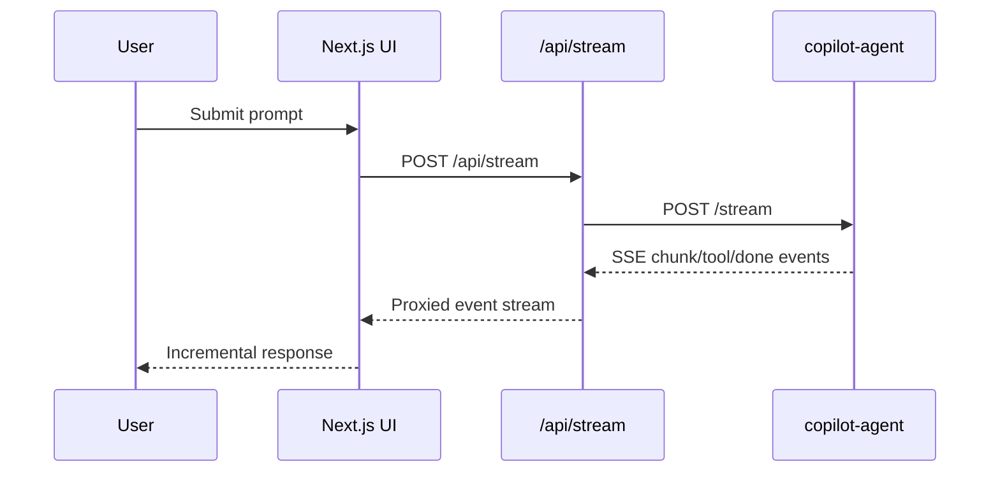
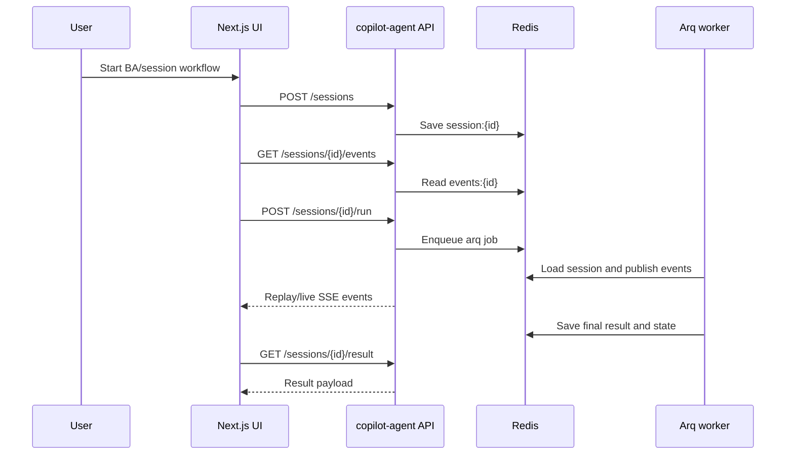
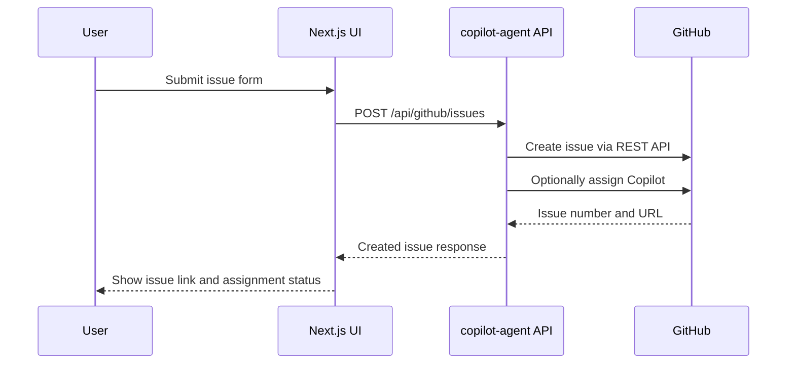

# API Flows

## Stateless chat flow

```mermaid
sequenceDiagram
    participant User
    participant UI as Next.js UI
    participant Proxy as /api/stream
    participant Agent as copilot-agent

    User->>UI: Submit prompt
    UI->>Proxy: POST /api/stream
    Proxy->>Agent: POST /stream
    Agent-->>Proxy: SSE chunk/tool/done events
    Proxy-->>UI: Proxied event stream
    UI-->>User: Incremental response
```

## Stateful session flow

```mermaid
sequenceDiagram
    participant User
    participant UI as Next.js UI
    participant API as copilot-agent API
    participant Redis
    participant Worker as Arq worker

    User->>UI: Start BA/session workflow
    UI->>API: POST /sessions
    API->>Redis: Save session:{id}
    UI->>API: GET /sessions/{id}/events
    API->>Redis: Read events:{id}
    UI->>API: POST /sessions/{id}/run
    API->>Redis: Enqueue arq job
    Worker->>Redis: Load session and publish events
    API-->>UI: Replay/live SSE events
    Worker->>Redis: Save final result and state
    UI->>API: GET /sessions/{id}/result
    API-->>UI: Result payload
```

## GitHub issue creation flow

```mermaid
sequenceDiagram
    participant User
    participant UI as Next.js UI
    participant API as copilot-agent API
    participant GitHub

    User->>UI: Submit issue form
    UI->>API: POST /api/github/issues
    API->>GitHub: Create issue via REST API
    API->>GitHub: Optionally assign Copilot
    GitHub-->>API: Issue number and URL
    API-->>UI: Created issue response
    UI-->>User: Show issue link and assignment status
```
