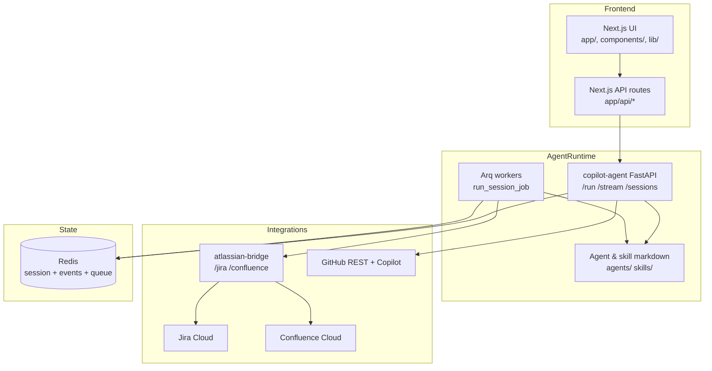

# System Architecture Design

## Overview

The repository implements an AI-assisted SDLC platform with a browser UI, an agent execution API, and an Atlassian integration service. The dominant runtime architecture is:

- **Presentation layer:** Next.js UI in `sdlc-app`
- **Agent orchestration layer:** FastAPI service plus Arq workers in `sdlc-app/services/copilot-agent`
- **Integration layer:** FastAPI proxy in `atlassian-bridge`
- **State layer:** Redis for session documents, event streams, and job queue data

## Component diagram

Mermaid source files are stored in [diagrams/system-overview.mmd](diagrams/system-overview.mmd) and [diagrams/session-lifecycle.mmd](diagrams/session-lifecycle.mmd).

## Deployment notes

| Runtime | Default port | Notes |
|---|---|---|
| Next.js UI | `3000` | Uses `NEXT_PUBLIC_API_URL` to reach the agent API |
| copilot-agent API | `8000` in UI defaults, `8001` in some standalone README examples | Port is deployment-configurable |
| atlassian-bridge | `8002` | Separate service with Atlassian credentials |
| Redis | `6379` | Required for `/sessions/*` and workers |

## Architectural characteristics

- **Stateless fast path:** `/run` and `/stream` execute directly inside the API process.
- **Stateful workflow path:** `/sessions/*` stores session state in Redis and delegates execution to workers.
- **Human approval support:** session states include `awaiting_approval`, `approved`, and `rejected`.
- **Credential isolation:** Atlassian credentials stay inside `atlassian-bridge`; GitHub token usage stays in the Python backend.
- **Extensibility by files:** agents and skills are loaded from markdown files, not compiled registries.
