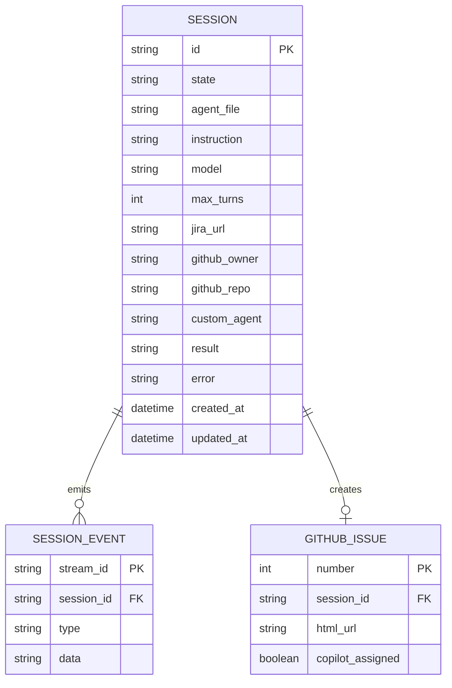

# Conceptual ER Diagram

The live system uses Redis, but the following conceptual entities describe the shape of persisted workflow data.

## Relationship notes

- A `SESSION` may emit many `SESSION_EVENT` records during a streamed run.
- A `SESSION` may create zero or one GitHub issue through `/github/issues`.
- Jira and Confluence URLs are referenced by value from the session rather than normalized into separate tables.
