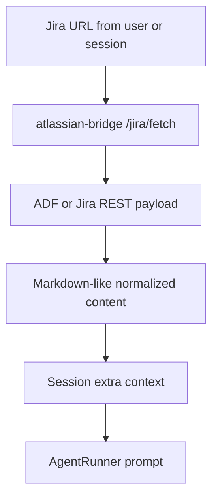
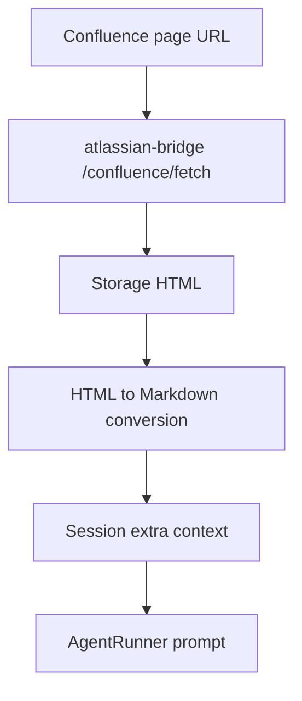
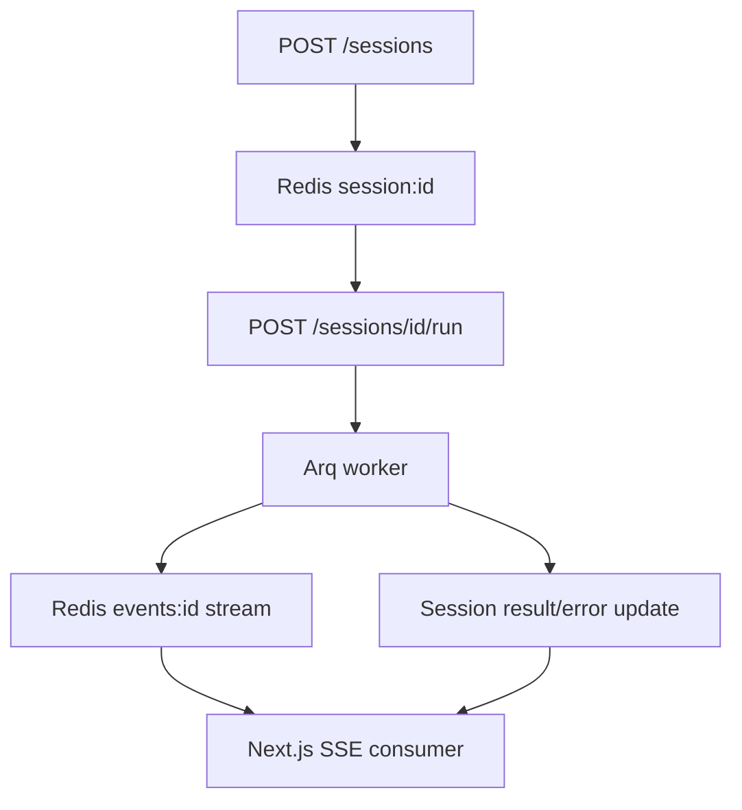
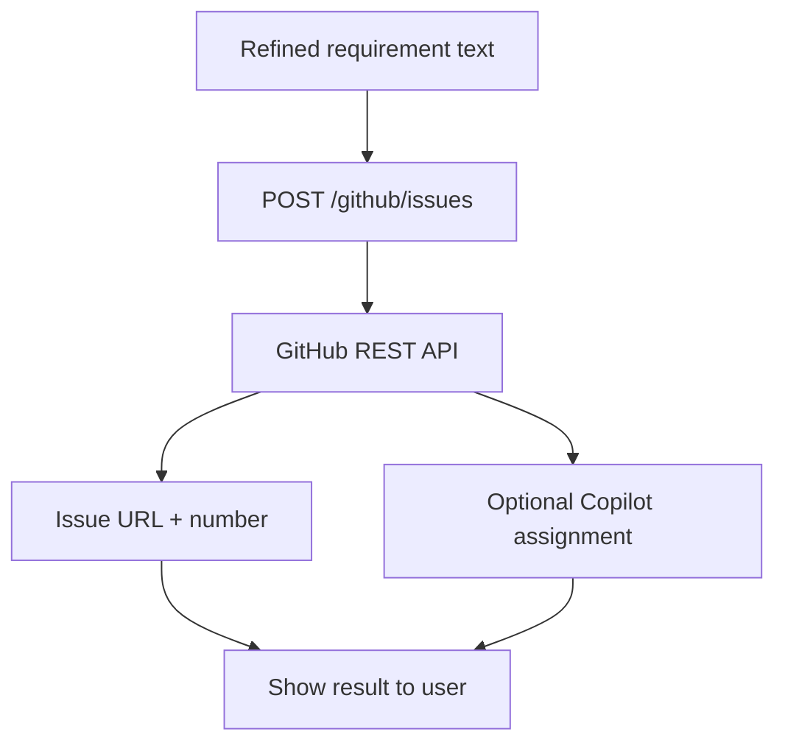

# Data Flows

## Jira context flow

```mermaid
flowchart TD
    JiraURL[Jira URL from user or session] --> Bridge[atlassian-bridge /jira/fetch]
    Bridge --> ADF[ADF or Jira REST payload]
    ADF --> Markdown[Markdown-like normalized content]
    Markdown --> Session[Session extra context]
    Session --> Agent[AgentRunner prompt]
```

## Confluence context flow

```mermaid
flowchart TD
    PageURL[Confluence page URL] --> Fetch[atlassian-bridge /confluence/fetch]
    Fetch --> Storage[Storage HTML]
    Storage --> Convert[HTML to Markdown conversion]
    Convert --> Session[Session extra context]
    Session --> Agent[AgentRunner prompt]
```

## Session execution flow

```mermaid
flowchart TD
    Create[POST /sessions] --> Save[Redis session:id]
    Save --> Queue[POST /sessions/id/run]
    Queue --> Worker[Arq worker]
    Worker --> Events[Redis events:id stream]
    Worker --> Result[Session result/error update]
    Events --> UI[Next.js SSE consumer]
    Result --> UI
```

## GitHub issue flow

```mermaid
flowchart TD
    RefinedSpec[Refined requirement text] --> GitHubIssue[POST /github/issues]
    GitHubIssue --> REST[GitHub REST API]
    REST --> IssueURL[Issue URL + number]
    REST --> Copilot[Optional Copilot assignment]
    IssueURL --> UI[Show result to user]
    Copilot --> UI
```
