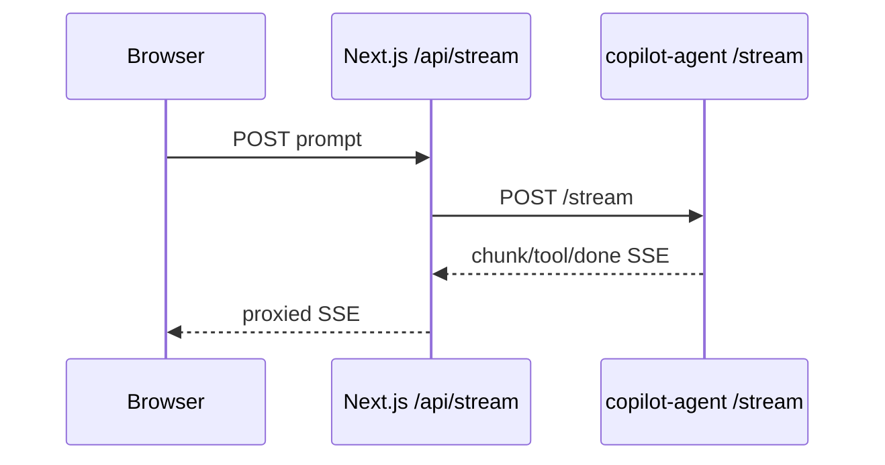
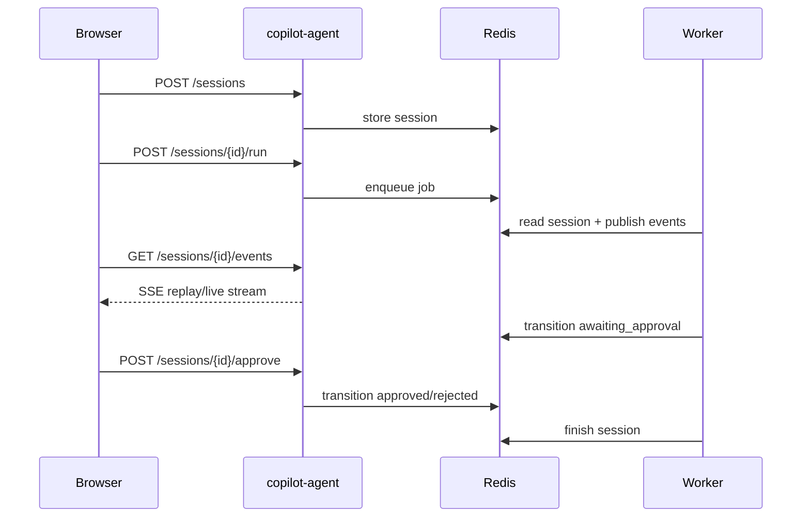
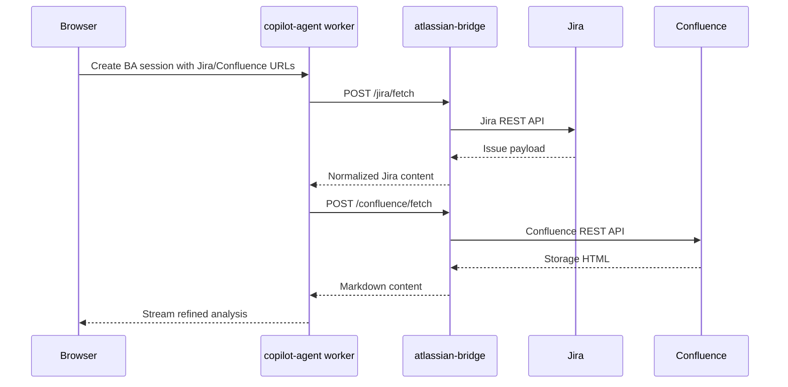

# Sequence Diagrams

## Chat to streaming answer

```mermaid
sequenceDiagram
    participant Browser
    participant Next as Next.js /api/stream
    participant Agent as copilot-agent /stream

    Browser->>Next: POST prompt
    Next->>Agent: POST /stream
    Agent-->>Next: chunk/tool/done SSE
    Next-->>Browser: proxied SSE
```

## Session with approval

```mermaid
sequenceDiagram
    participant Browser
    participant API as copilot-agent
    participant Redis
    participant Worker

    Browser->>API: POST /sessions
    API->>Redis: store session
    Browser->>API: POST /sessions/{id}/run
    API->>Redis: enqueue job
    Worker->>Redis: read session + publish events
    Browser->>API: GET /sessions/{id}/events
    API-->>Browser: SSE replay/live stream
    Worker->>Redis: transition awaiting_approval
    Browser->>API: POST /sessions/{id}/approve
    API->>Redis: transition approved/rejected
    Worker->>Redis: finish session
```

## Atlassian-assisted BA refinement

```mermaid
sequenceDiagram
    participant Browser
    participant API as copilot-agent worker
    participant Bridge as atlassian-bridge
    participant Jira
    participant Confluence

    Browser->>API: Create BA session with Jira/Confluence URLs
    API->>Bridge: POST /jira/fetch
    Bridge->>Jira: Jira REST API
    Jira-->>Bridge: Issue payload
    Bridge-->>API: Normalized Jira content
    API->>Bridge: POST /confluence/fetch
    Bridge->>Confluence: Confluence REST API
    Confluence-->>Bridge: Storage HTML
    Bridge-->>API: Markdown content
    API-->>Browser: Stream refined analysis
```
