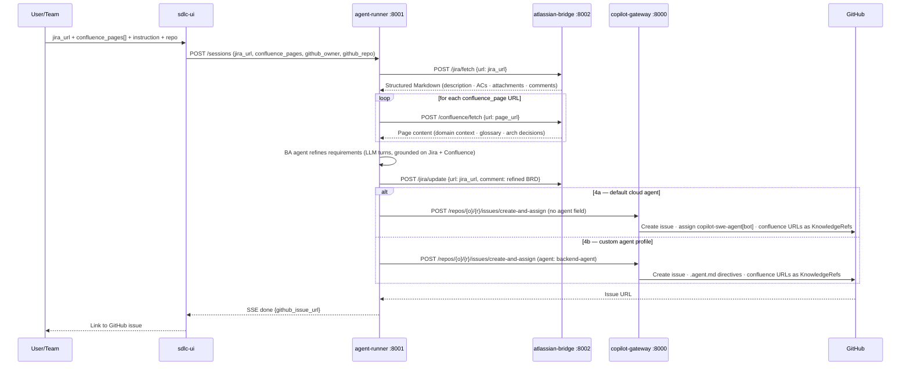
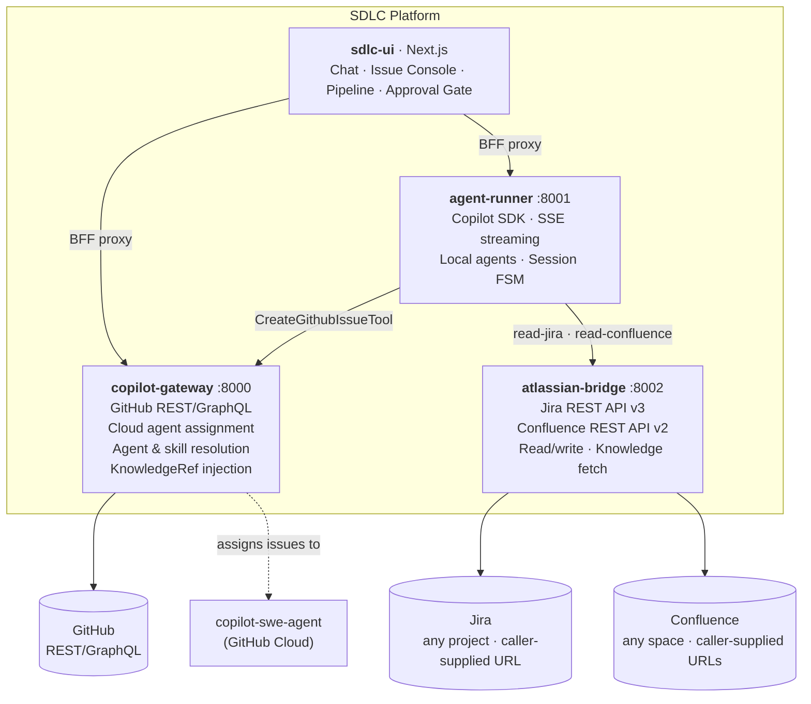

# SDLC Platform Redesign: Unified GitHub Copilot API Services

## Context

Two separate projects currently cover different parts of the SDLC automation problem:

- **`copilot-issue`** — a production-quality façade over GitHub REST/GraphQL that creates issues and assigns them to GitHub's cloud Copilot agent (`copilot-swe-agent[bot]`). Strong agent-resolution hierarchy, Pydantic models, BFF proxy UI. Weakness: no execution engine, no Jira, hardcoded skill registry.
- **`mypoc`** — a working agentic execution platform using the GitHub Copilot SDK with SSE streaming, dynamic agent/skill registries, Jira CLI, and rich SDLC-domain agents. Weakness: no GitHub issue integration, stateless, no human approval gate.

The goal is to redesign these into a unified platform that covers the full SDLC loop: Jira requirements → local agent analysis → BDD test generation → GitHub issue creation → cloud Copilot code generation → review → deploy.

---

## Atlassian Configuration

### Multi-team design principle

> **The service holds credentials. The caller provides context.**

This tool is designed for multiple teams across different Jira projects and Confluence spaces. No project key, board, or space is hardcoded in the service. The caller passes a full Jira ticket URL and zero-or-more Confluence page URLs at runtime. The `atlassian-bridge` service extracts the base URL from the caller-supplied links, looks up the stored credentials for that instance, and makes the API calls.

```
Caller provides:   jira_url      = "https://<instance>/browse/<TEAM>-<n>"
                   confluence_pages = ["https://<instance>/wiki/spaces/<space>/pages/<id>/..."]

Service provides:  ATLASSIAN_USER + ATLASSIAN_API_TOKEN  (env, never in requests)
```

### Server `.env` (credentials only — no project or space)

```dotenv
ATLASSIAN_URL=https://joeycmlam-1762529818344.atlassian.net   # authorised instance
ATLASSIAN_USER=<atlassian-account-email>
ATLASSIAN_API_TOKEN=<token from https://id.atlassian.com/manage-profile/security/api-tokens>
```

> For reference: the development Atlassian instance is `https://joeycmlam-1762529818344.atlassian.net`. The Jira API base is `.../rest/api/3/` and the Confluence API base is `.../wiki/api/v2/`. Any team's project (e.g. `SCRUM`, `PROJ`, `MOBILE`) and any Confluence space work without reconfiguration.

---

## Confluence as Knowledge Base

### Design philosophy: pointers, not pipelines

The existing `KnowledgeRef` model in `copilot-issue/api/app/models.py` already expresses this: the service injects **typed references** into the GitHub issue body; the agent fetches the actual content at task time using its tools. Confluence fits naturally into this model.

**Two consumption paths** (mirrors how skills work):

| Path | Consumer | Mechanism |
|---|---|---|
| **Local execution** | `agent-runner` (Copilot SDK) | `ConfluenceTool` calls `atlassian-bridge GET /confluence/pages/{id}` · content injected into agent context |
| **Cloud execution** | `copilot-swe-agent[bot]` | `KnowledgeRef(kind="confluence", value="<pageId>")` in issue body · agent fetches via `firm-rag` MCP or direct URL |

### KnowledgeRef extension

Add `confluence` as a 4th kind (minimal schema change):

```python
# copilot-issue/api/app/models.py
class KnowledgeRef(BaseModel):
    kind: Literal["repo_path", "url", "glossary", "confluence"]
    value: str
    # confluence value: full page URL supplied by the caller
    # e.g. "https://<instance>/wiki/spaces/<space>/pages/<id>/<title>"
```

```typescript
// copilot-issue/ui/lib/registry.ts + shared/schema.ts
export const KNOWLEDGE_KINDS = ["repo_path", "url", "glossary", "confluence"] as const;
```

Since the caller already provides full Confluence page URLs, `render_issue_body()` injects them directly into the directives block — no server-side URL construction needed:
```
KnowledgeRef(kind="confluence", value="https://<instance>/wiki/spaces/ENG/pages/12345/Arch")
→ injected as-is into the <!-- copilot-issue-api-v2: directives --> block
```
The cloud Copilot agent can fetch any HTTPS URL, so a full Confluence URL works with the existing `url` kind too. The `confluence` kind is still added for semantic clarity in the UI picker.

### New `read-confluence` skill

Add `mypoc/services/copilot-agent/skills/read-confluence.skill.md` — system-prompt instructions for local agents on how to call `atlassian-bridge` to fetch a Confluence page and extract relevant context. Analogous to `read-jira.skill.md`.

### How BA agent uses Confluence

When refining a Jira ticket, the BA agent:
1. Reads the Jira ticket (`read-jira` skill → `atlassian-bridge`)
2. Identifies linked Confluence pages from ticket description or remote links
3. Fetches those pages (`read-confluence` skill → `atlassian-bridge GET /confluence/pages/{id}`)
4. Uses the Confluence content as domain context when generating the BRD and ACs
5. Injects `KnowledgeRef(kind="confluence", value="<pageId>")` entries into the GitHub issue body so the cloud Copilot agent can also access the same knowledge

### Confluence API endpoints needed

```
GET /confluence/spaces                   → list available spaces
GET /confluence/pages/{id}               → fetch page content (storage or markdown)
GET /confluence/pages/search?q={query}&space={key}  → search pages
GET /confluence/pages/{id}/children      → child pages (for space navigation)
```

Atlassian Confluence REST API v2 base: `https://joeycmlam-1762529818344.atlassian.net/wiki/api/v2/`

---

## Priority Scenario: Jira → BA Refinement → GitHub Copilot

The concrete MVP flow that must work end-to-end first (from `notes.md`):

1. **Read** — fetch the initial Jira ticket (description, ACs, attachments, comments)
2. **Refine** — BA agent improves the Jira ticket (fills gaps, sharpens ACs, writes structured BRD)
3. **Create** — extract refined requirements and create a GitHub issue from them
4. **Assign** — hand the GitHub issue to the cloud Copilot agent in one of two modes:
   - **4a. Default** — assign to `copilot-swe-agent[bot]` with no custom agent profile
   - **4b. Custom** — assign with a named `.agent.md` profile (e.g. `backend-agent`, `architect-agent`)



### Minimum phases to enable this scenario

This flow is achievable with **Phases 1 + 2 + 4** only (atlassian-bridge + SkillStore + CreateGithubIssueTool). Phases 3, 5, 6 are important but not blockers for this core flow.

The `POST /sessions` payload — caller provides full URLs, no hardcoded project or space:

```json
{
  "agent_file": "agents/ba.agent.md",
  "instruction": "Refine this ticket and create a GitHub issue for implementation",
  "model": "gpt-4o",
  "jira_url": "https://joeycmlam-1762529818344.atlassian.net/browse/SCRUM-1",
  "confluence_pages": [
    "https://joeycmlam-1762529818344.atlassian.net/wiki/spaces/ENG/pages/12345/Architecture-Overview"
  ],
  "create_github_issue": true,
  "github_owner": "my-org",
  "github_repo": "my-repo",
  "agent_assignment": { "custom_agent": "backend-agent" }
}
```

`confluence_pages` is optional — omit it and the agent works from the Jira ticket alone. Omit `agent_assignment` for the Step 4a (default Copilot) path.

---

## Recommended Architecture: Three Backend Services + One UI

The projects should **not** be merged into a monolith. They serve genuinely different execution surfaces. Consolidate into three services:



### Service Ownership

| Service | Evolves From | Auth | Responsibility |
|---|---|---|---|
| `copilot-gateway` | `copilot-issue/api` | GitHub PAT (`repo`, `read:org`) | GitHub REST/GraphQL, cloud Copilot agent assignment, agent/skill resolution, KnowledgeRef injection |
| `agent-runner` | `mypoc/services/copilot-agent` | Copilot CLI credential store | Local Copilot SDK execution, SSE streaming, session FSM, sub-agent delegation |
| `atlassian-bridge` | `mypoc/services/jira-cli` | Atlassian API token (shared for Jira + Confluence) | Jira read/write + Confluence page fetch; single service since same auth |
| `sdlc-ui` | Merge of both UIs | Headers via BFF | Chat view, Issue Console, Pipeline view, Approval Gate |

---

## The Key Architectural Insight

The same skill serves **two consumers**:
- The `.skill.md` **body** is system-prompt injection for the local `agent-runner` (Copilot SDK).
- The `SkillRef(name, version)` in the issue body's `<!-- copilot-issue-api-v2: directives -->` block is the directive for `copilot-swe-agent[bot]` in the cloud.

The `render_issue_body()` directives block in `copilot-issue/api/app/services.py` is the **integration contract** between local and cloud execution. When local agents finish work, they call `copilot-gateway` to create a GitHub issue with their output as the prompt and skill refs as directives.

---

## Canonical `.agent.md` Schema (Unified Superset)

```yaml
---
id: ba                             # REQUIRED — machine-readable key (add to all copilot-issue agents)
name: "BA Asset Management"
description: "Use when: ..."
triggers:
  - "refine.*jira|improve.*jira"   # regex for auto-routing (agent-runner only)
skills:
  - read-jira
  - read-confluence                # NEW — fetch Confluence pages as domain context
  - bdd-scenarios
tools:
  - bash_exec
  - github
  - firm-rag                       # MCP tool for cloud agents (resolves confluence KnowledgeRefs)
target: github-copilot             # vscode | github-copilot | any (copilot-gateway only)
handoffs:                          # explicit chaining (copilot-gateway only)
  - architect-agent
agents:                            # sub-agent delegation (agent-runner only)
  - jira-reader
allowed_teams: []                  # team slugs; empty = all (copilot-gateway only)
argument-hint: "Jira ticket ID e.g. SCRUM-1"  # UI hint
max_turns: 20
knowledge_refs:                    # Confluence pages to ground the agent on (optional)
  - kind: confluence
    value: "<spaceKey>/<page-title-slug>"
---
```

The **only breaking change** to existing files: add `id:` field to all 9 `copilot-issue/api/agents/*.md` files.

---

## SDLC Stage → Agent/Skill Mapping

[sdlc-pipeline.drawio](sdlc-pipeline.drawio) — open with [app.diagrams.net](https://app.diagrams.net) or the VS Code draw.io extension.

> Colour key: blue = local execution (agent-runner) · purple = cloud execution (copilot-gateway) · yellow diamond = human approval gate

---

## Migration Phases

### Phase 0: Schema Alignment (1–2 days) — no code changes
- Add `id:` field to all 9 `copilot-issue/api/agents/*.md` files
- Agree on canonical schema; document it

### Phase 1: Extract `atlassian-bridge` (3–4 days)

Replaces the planned `jira-bridge` — same scope plus Confluence. Both Jira and Confluence share the same API token and base URL so there is no reason to split them into two services.

**Required `.env` (credentials only):**
```dotenv
ATLASSIAN_URL=https://joeycmlam-1762529818344.atlassian.net
ATLASSIAN_USER=<atlassian-account-email>
ATLASSIAN_API_TOKEN=<token from https://id.atlassian.com/manage-profile/security/api-tokens>
```
No project key or space — those are always caller-supplied.

**New files:**
- `atlassian-bridge/app/main.py` — FastAPI app
- `atlassian-bridge/app/jira.py` — Jira router
- `atlassian-bridge/app/confluence.py` — Confluence router
- `atlassian-bridge/app/models.py` — `FetchRequest`, `UpdateRequest`, `IssueResponse`, `PageResponse`
- `atlassian-bridge/app/client.py` — shared `httpx.AsyncClient` with Basic auth (lifespan-managed); resolves base URL from `ATLASSIAN_URL` env

**Jira endpoints — caller passes the full issue URL in the request body:**
```
GET  /health
POST /jira/fetch          body: {url: "<full-browse-url>"}  → IssueResponse (markdown)
POST /jira/update         body: {url, comment?, description?, transition?}
POST /jira/transitions    body: {url}  → list of available transitions
```

**Confluence endpoints — caller passes the full page URL:**
```
POST /confluence/fetch    body: {url: "<full-page-url>"}    → PageResponse (markdown)
POST /confluence/search   body: {query, space_key?, limit?} → list[PageSearchResult]
POST /confluence/children body: {url}  → list of child pages
```

Using `POST` + body (rather than `GET` + query params) keeps full URLs out of server logs.

**URL parsing in the bridge:**
The bridge validates the incoming URL's host against `ATLASSIAN_URL` and returns `403` for any other host, preventing SSRF. It extracts the issue key or page ID from the path and calls the Atlassian REST API using the stored credentials.

**Auth:** `Authorization: Basic base64(ATLASSIAN_USER:ATLASSIAN_API_TOKEN)` — identical for Jira and Confluence.

**Note:** `ba.agent.md`'s `bash_exec → jira_cli.py` path still works as a fallback. Update `jira_cli.py` env vars from `JIRA_URL/JIRA_USER/JIRA_API_TOKEN` → `ATLASSIAN_*` with backward-compat aliases.

### Phase 2: Add `SkillStore` to `copilot-gateway` (2–3 days)
Mirror the existing `AgentStore` pattern in `copilot-issue/api/app/services.py`.

**Files to modify:**
- `copilot-issue/api/app/services.py` — add `SkillStore` class (identical structure to `AgentStore`)
- `copilot-issue/api/app/models.py` — add `SkillRecord`, `SkillList`
- `copilot-issue/api/app/main.py` — add `GET /skills`, `POST /skills/refresh`
- Create `copilot-issue/api/skills/*.skill.md` — add bodies for the 10 currently-label-only skills from `ui/lib/registry.ts`
- `copilot-issue/ui/lib/registry.ts` — replace static `SKILLS` list with dynamic `/proxy/skills` query (keep static as fallback)

### Phase 3: Add Session FSM to `agent-runner` (3–5 days)
This enables stateful SDLC pipelines and the human approval gate.

**New files:**
- `mypoc/services/copilot-agent/session_store.py` — `SessionStore` with in-memory dict, TTL cleanup, state machine: `pending → running → awaiting_approval → approved/rejected → completed/failed`

**Files to modify:**
- `mypoc/services/copilot-agent/api_server.py` — add session endpoints:
  ```
  POST   /sessions
  GET    /sessions/{id}
  POST   /sessions/{id}/run
  GET    /sessions/{id}/events     (SSE — same async generator pattern as POST /stream)
  POST   /sessions/{id}/approve    (action: approve | reject)
  GET    /sessions/{id}/result
  DELETE /sessions/{id}
  ```
- `mypoc/services/copilot-agent/api_server.py` — keep `POST /stream` for stateless backward compat

**Session model:**
```python
class Session(BaseModel):
    id: str
    state: Literal["pending","running","awaiting_approval","approved","rejected","completed","failed"]
    agent_file: str; instruction: str; model: str
    created_at: datetime; updated_at: datetime
    result: str | None
    github_issue_url: str | None
    jira_url: str | None              # full caller-supplied Jira ticket URL
    confluence_pages: list[str] = []  # caller-supplied Confluence page URLs
```

### Phase 4: Add `CreateGithubIssueTool` to `agent-runner` (2 days)
Allows local agents to hand off work to the cloud Copilot agent. **Required for the Priority Scenario.**

**Files to modify:**
- `mypoc/services/copilot-agent/agent_copilot.py` — add `CreateGithubIssueTool` to `_build_tools()`:
  ```python
  # Calls: copilot-gateway POST /repos/{owner}/{repo}/issues/create-and-assign
  # Schema: owner, repo, title, prompt, agent (optional), skills (optional list)
  # agent absent → Step 4a default Copilot; agent present → Step 4b custom profile
  ```

### Phase 5: Merge UIs (3–5 days)
Create `sdlc-ui/` as a new Next.js App Router project.

**Keep from `copilot-issue/ui`:**
- TanStack Query v5, SettingsProvider, BFF proxy (`app/api/proxy/[...path]/route.ts`), `shared/schema.ts` Zod shapes

**Keep from `mypoc`:**
- Chat components: `agent-chat.tsx`, `chat-container.tsx`, `chat-message.tsx`, `tool-execution-card.tsx`, `lib/api.ts` (SSE consumer)

**New views:**
- Issue Console (port from `copilot-issue/ui`)
- Pipeline view: session list, session state, SSE stream, approval buttons

### Phase 6: `POST /sdlc/pipeline` Orchestration Endpoint (3–4 days)
Add to `copilot-gateway`. High-level endpoint supporting named workflow types.

**Files to modify:**
- `copilot-issue/api/app/main.py` — add `POST /sdlc/pipeline`, `GET /sdlc/pipeline/{session_id}`
- Create `copilot-issue/api/app/pipeline.py` — `PipelineService` with:
  - `"jira-to-copilot"` workflow — the Priority Scenario (Phases 1–4)
  - `"full-sdlc"` workflow — all 5 stages with approval gates

---

## Unified SSE Event Protocol

Adopt across all streaming endpoints:

```json
{"type": "chunk",       "content": "partial text"}
{"type": "tool",        "name": "bash_exec", "input": "..."}
{"type": "tool_result", "name": "bash_exec", "output": "..."}
{"type": "agent",       "name": "jira-reader", "action": "start"}
{"type": "state",       "session_id": "...", "state": "awaiting_approval"}
{"type": "done",        "content": "final text", "session_id": "..."}
{"type": "error",       "message": "...", "code": 500}
```

---

## Key Tradeoffs

| Decision | Rationale |
|---|---|
| Keep two execution modes (cloud vs local) | They have different capabilities: cloud Copilot can write to GitHub repos; local Copilot SDK can call Jira, run tests, execute shell |
| In-memory sessions (no Redis) | V1 simplicity; agent runs are short-lived; add Redis when horizontal scaling is needed |
| Keep `bash_exec` in agents | The Jira CLI path is battle-tested; HTTP to `jira-bridge` is an optional upgrade, not a forced migration |
| Keep `agent.py` Azure AI Inference backend | Valuable for environments without the Copilot CLI |
| Don't merge `copilot-issue` and `mypoc` | Clean separation of concerns; merging would create a large refactor for limited benefit |
| `agent_assignment` optional in Step 4 | Supports both default (4a) and custom-agent (4b) assignment from the same endpoint |
| Merge Jira + Confluence into `atlassian-bridge` | Same base URL, same API token, same auth header — no reason to split; reduces env var duplication |
| `confluence` KnowledgeRef value = full URL | Caller already has the URL; injecting it directly avoids server-side URL construction and works for any Atlassian instance without mapping logic |
| Caller-supplied URLs rather than project/space config | Makes the service stateless w.r.t. team context — any team can use the same deployment with their own Jira + Confluence URLs; no per-team config needed |
| `POST /jira/fetch` instead of `GET /jira/issues/{key}` | Keeps full URLs out of server access logs; allows the bridge to validate the host before making outbound calls (SSRF protection) |

---

## Critical Files

| File | Change | Phase |
|---|---|---|
| `copilot-issue/api/agents/*.md` (9 files) | Add `id:` field | 0 |
| `copilot-issue/api/app/models.py` | Add `KnowledgeRef` kind `confluence`, `SkillRecord`, `Session` | 1, 2–6 |
| `copilot-issue/api/app/services.py` | Add `SkillStore`; update `render_issue_body()` to resolve `confluence` refs to URLs | 1, 2 |
| `copilot-issue/api/app/main.py` | Add skills + pipeline endpoints | 2, 6 |
| `copilot-issue/ui/lib/registry.ts` | Add `confluence` to `KNOWLEDGE_KINDS`; dynamic skills query | 1, 2 |
| `copilot-issue/ui/shared/schema.ts` | Add `confluence` to `knowledgeRefSchema` enum | 1 |
| `atlassian-bridge/app/main.py` | New service — Jira + Confluence FastAPI | 1 |
| `atlassian-bridge/app/confluence.py` | New — Confluence REST API v2 router | 1 |
| `mypoc/services/copilot-agent/skills/read-confluence.skill.md` | New skill — fetch Confluence pages via atlassian-bridge | 1 |
| `mypoc/services/copilot-agent/session_store.py` | New — SessionStore FSM | 3 |
| `mypoc/services/copilot-agent/api_server.py` | Add session endpoints | 3 |
| `mypoc/services/copilot-agent/agent_copilot.py` | Add `CreateGithubIssueTool` + `ConfluenceTool` | 4 |

---

## Verification

- **Phase 1 — Jira fetch:** `POST localhost:8002/jira/fetch` `{"url":"https://.../browse/SCRUM-1"}` returns structured JSON; repeat with a different team's ticket URL (e.g. `MOBILE-5`) — both work without any config change
- **Phase 1 — Confluence fetch:** `POST localhost:8002/confluence/fetch` `{"url":"https://.../wiki/spaces/ENG/pages/12345/..."}` returns page markdown
- **Phase 1 — Confluence search:** `POST localhost:8002/confluence/search` `{"query":"architecture","space_key":"ENG"}` returns matching pages
- **Phase 1 — SSRF guard:** `POST localhost:8002/jira/fetch` `{"url":"https://evil.example.com/..."}` returns `403`
- **Phase 1 — KnowledgeRef:** GitHub issue body contains `confluence` kind ref whose `value` is the full page URL passed by the caller
- **Phase 2:** `curl localhost:8000/skills` returns dynamic list including `read-confluence`
- **Phase 3:** `POST /sessions` → run → events stream → `awaiting_approval` → `POST /approve` → `completed`
- **Phase 4:** `POST /sessions` with `jira_url` + `confluence_pages` from Team A; repeat with Team B's URLs — agent fetches both, produces enriched BRD, creates GitHub issue with Confluence URLs as KnowledgeRefs
- **Phase 5:** UI input accepts a Jira URL and optional list of Confluence page URLs; both teams can use the same UI instance
- **Phase 6:** `POST /sdlc/pipeline` with `workflow: "jira-to-copilot"`, a Jira URL, and Confluence page URLs runs end-to-end; GitHub issue includes Confluence refs accessible to cloud Copilot agent
